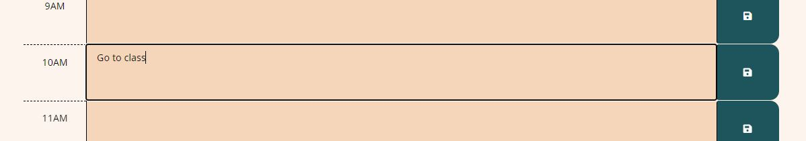

# today-and-now

## Description

This is a short localStorage and time keeping project that serve as a daily planner and keeps track of the current day and time between 9AM and 5PM. I got learn more about dayjs(), localStorage and changing attributes through javascript.

I was given a small amount of starter code. Mainly html and CSS. I slightly modified both to fit my astethic choices and get the hoped for end result.

## Installation

N/A

## Usage

To visite my website go to the following URL: https://mayalynn96.github.io/today-and-now/

When you first get to the page, the current date including the day of the week shows up in the header.

All timeblocks that are in the past turn cream Yellow, the current timeblock turns orange and the future timeblocks turn green.

When the user writes in the time block and clicks the save button on the right, the text entered will be saved to local storage and still be there on page reload. If the user erases a text item and saves, it won't appear on reload.

When the user clicks the top "Clear All" button, the localStorage is resest, the page reloads and all text items will be gone for a fresh start.

## Credits

N/A

## License
N/A